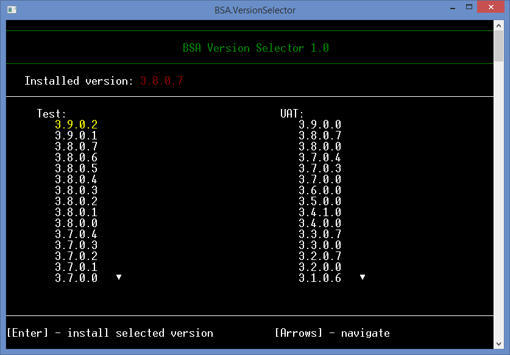

# BSA Version Selector

Simple console app for quick switching between different versions of a desktop application that we develop. It helps our team (especially testers) in day-to-day work with many versions of the application on different environments.

**Some basic information about this simple app**
----------------
- It is a wrapper for [msiexec](https://docs.microsoft.com/en-us/windows-server/administration/windows-commands/msiexec) which performs operations on Windows Installer.
- It detects currently installed version of the application.
- It displays a list of available versions to install on two environments: Test and UAT.
- It can automatically uninstall current version and install selected version of the application.
- It is integrated with [BSA Config Selector](https://github.com/sstefanczuk/bsa-config-selector) and can start the config selector app after installing new version.

